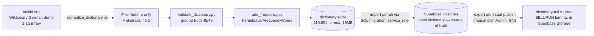
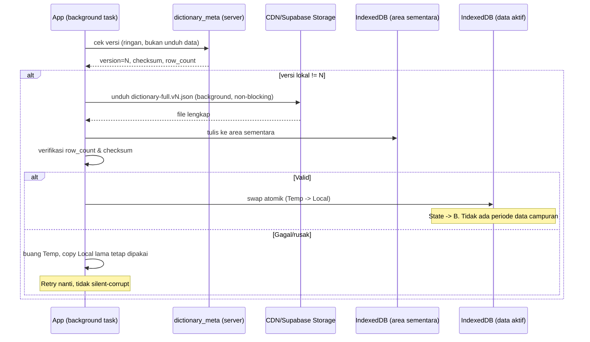
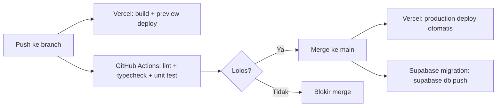

# Architecture Document — Sobat Deutsch

**Versi Dokumen:** 2.3 — disinkronkan dengan PRD v4.3 (kontradiksi §4.1 diperbaiki)
**Tanggal:** 20 Agustus 2026
**Sumber acuan:** [docs/PRD.md](./PRD.md) v4.0 — dokumen ini menerjemahkan keputusan PRD (§21 Arsitektur Teknis, §12 Skema Data, §6–9 Kebutuhan Fungsional/NFR) menjadi desain teknis yang bisa langsung diimplementasikan. Setiap keputusan di sini merujuk balik ke bagian PRD yang relevan — jangan menyimpang tanpa mengupdate PRD juga.

---

## Daftar Isi

1. [Ringkasan Arsitektur](#1-ringkasan-arsitektur)
2. [Diagram Arsitektur](#2-diagram-arsitektur)
3. [Modul](#3-modul)
4. [Skema Database](#4-skema-database)
5. [SQL Migration](#5-sql-migration)
6. [API Contract](#6-api-contract)
7. [Infrastruktur](#7-infrastruktur)
8. [Keamanan](#8-keamanan)
9. [Skalabilitas](#9-skalabilitas)

---

## 1. Ringkasan Arsitektur

### 1.1 Prinsip Utama

Aplikasi ini **local-first untuk fitur belajar**, dengan server yang sengaja dibuat sekecil mungkin. Ini bukan pola arsitektur konvensional "client tipis, server tebal" — melainkan sebaliknya: client menanggung sebagian besar logic (pencarian kamus, SRS, kuis, konjugasi), server hanya menangani auth, sinkronisasi progres, dan full-text search untuk kamus lengkap (PRD §21.1).

### 1.2 Model Progressive Full Download (revisi dari rencana Tier 1/Tier 2)

**Direvisi 20 Agustus 2026** (PRD §21.3) — rencana awal (subset Tier 1 + fallback Tier 2) berasumsi full dictionary bisa ±1GB. Setelah pipeline nyata dijalankan, ukurannya cuma **19,02MB untuk seluruh 110.894 lemma** — jauh di bawah budget yang tadinya dialokasikan untuk subset saja. Arsitektur disederhanakan: **seluruh kamus diunduh utuh** ke setiap client (bukan dipecah subset+fallback), lewat unduhan background yang tidak memblokir apa pun (*stale-while-revalidate*).

**Tiga status client (state machine, PRD §21.3):**

| State | Kondisi | Sumber pencarian |
|---|---|---|
| **A** | Belum pernah selesai unduh kamus penuh | Server (online), `<500ms`. Offline → pesan jelas, bukan "tidak ketemu" |
| **B** | Kamus lokal lengkap & up to date | 100% lokal, `<100ms`, tanpa jaringan |
| **C** | Kamus lokal ada tapi usang (versi baru tersedia) | **Tetap lokal (copy lama)** — tidak pernah mundur ke server hanya karena ada update. Versi baru diunduh diam-diam di background, swap atomik setelah selesai & terverifikasi |

Kunci "seamless": transisi ke State C tidak pernah terasa oleh user — mereka selalu dapat pencarian instan, cuma pindah dari "sudah cukup benar" ke "paling baru" tanpa jeda.

### 1.3 Stack Teknis (ringkasan dari PRD §21.2)

| Layer | Teknologi | Alasan singkat |
|---|---|---|
| Frontend | React + Vite + TypeScript + Tailwind CSS | SPA murni, tidak butuh SSR karena local-first |
| Data lokal (dictionary PENUH + progres user) | Dexie.js (IndexedDB) + FlexSearch/MiniSearch (index pencarian) | Menampung seluruh 110.894 lemma (19-30MB), native browser, tanpa dependency berat |
| Offline & PWA | vite-plugin-pwa | Service worker + manifest tanpa kode manual |
| Backend & Auth | Supabase (Postgres + Auth + Row-Level Security) | Menutupi seluruh kebutuhan auth (§7.1 PRD) tanpa backend custom |
| Database (progres user + dictionary source of truth) | Postgres (dalam Supabase project yang sama — keputusan OQ-09 final, 19MB jauh di bawah limit 500MB) | Satu project, tidak perlu split ke Neon |
| Hosting frontend | Vercel | Static build, auto-deploy |
| Backend custom (bila perlu) | Supabase Edge Function (Deno) | Hanya untuk logic yang tidak bisa lewat query langsung (mis. migrasi data Guest→akun) |

### 1.4 Non-Goals Arsitektur

Sesuai PRD §3.2 dan §21.5: tidak ada Docker, tidak ada Redis, tidak ada NestJS/backend custom besar, tidak ada self-hosted Postgres. Ditambahkan hanya kalau ada bottleneck terukur nyata, bukan antisipasi.

---

## 2. Diagram Arsitektur

### 2.1 Arsitektur Sistem Menyeluruh

```mermaid
graph TB
    subgraph Client["CLIENT — Browser/PWA (React + Vite)"]
        UI[UI Layer<br/>Dictionary / Flashcard / Quiz / Grammar / Teacher / Admin]
        SRS[SRS Engine<br/>SM-2 scheduler]
        SearchIdx[Search Index<br/>FlexSearch/MiniSearch]
        LocalDB[(Dexie/IndexedDB<br/>dictionary PENUH — 110.894 lemma<br/>State A/B/C, lihat §1.2<br/>+ Deck, SRSCard, ReviewLog<br/>QuizSession, MistakeTracker)]
        SW[Service Worker<br/>PWA offline cache]
        SyncEngine[Sync Engine<br/>queue perubahan offline]
        DictSync[Dictionary Sync<br/>cek versi, unduh background,<br/>swap atomik — §2.4]

        UI --> SRS
        UI --> SearchIdx
        SearchIdx --> LocalDB
        SRS --> LocalDB
        UI --> SyncEngine
        DictSync --> LocalDB
        SW -.cache app shell.-> UI
    end

    subgraph Supabase["SUPABASE (Backend Terkelola)"]
        Auth[Supabase Auth<br/>email/password, OAuth Google]
        PG[(Postgres<br/>profiles, decks, srs_cards,<br/>review_logs, dictionary,<br/>dictionary_meta, dictionary_suggestions,<br/>teacher_applications, admin_decision_log,<br/>quiz_sessions)]
        RLS[Row-Level Security]
        EdgeFn[Edge Functions<br/>migrate-guest-data<br/>dictionary-search<br/>admin-review-suggestion<br/>admin-review-application]
        FTS[Full-Text Search<br/>tabel dictionary — State A saja]

        Auth --> PG
        RLS -.enforced on.-> PG
        EdgeFn --> PG
        FTS --> PG
    end

    subgraph Storage["Vercel + Supabase Storage"]
        StaticApp[React build statis<br/>di Vercel]
        DictFile[dictionary-full.v{N}.json<br/>SELURUH 110.894 lemma, ~19-30MB<br/>di Supabase Storage]
    end

    DictSync -->|cek dictionary_meta.version<br/>ringan, bukan unduh data| PG
    DictSync -->|State A atau C: unduh background<br/>tidak blocking UI| DictFile
    SearchIdx -->|HANYA saat State A<br/>belum pernah selesai unduh| FTS
    SyncEngine <-->|HTTPS, saat online<br/>Registered User only| Auth
    SyncEngine <-->|push/pull progres| PG
    UI -->|initial page load| StaticApp

    style Client fill:#e8f4f8
    style Supabase fill:#f8f0e8
    style Storage fill:#f0f8e8
```

### 2.2 Alur Data Pipeline (Build-time, Offline)



### 2.3 Sequence — Pencarian Kata (State Machine A/B/C)

```mermaid
sequenceDiagram
    participant U as User
    participant UI as UI (React)
    participant Idx as SearchIndex (client)
    participant Local as Dexie/IndexedDB
    participant Edge as Edge Function
    participant PG as Supabase Postgres (FTS)

    U->>UI: ketik "Verantwortung"
    alt State B/C -- kamus lokal ada (lengkap atau usang)
        UI->>Idx: query("Verantwortung")
        Idx->>Local: cari di index lokal
        Local-->>UI: hasil <100ms, TANPA jaringan
        Note over Local,UI: State C tetap pakai copy lama;<br/>update baru jalan di background terpisah
    else State A -- belum pernah selesai unduh
        alt Online
            UI->>Edge: search(query)
            Edge->>PG: full-text search
            PG-->>Edge: hasil
            Edge-->>UI: hasil <500ms
        else Offline
            UI-->>U: "Butuh koneksi untuk pencarian pertama kali"
        end
    end
```

### 2.4 Sequence — Unduhan Background & Swap Atomik (State A→B, C→B)



### 2.5 Sequence — Alur Koreksi Teacher → Admin → Republish

```mermaid
sequenceDiagram
    participant T as Teacher
    participant PG as Postgres (dictionary_suggestions)
    participant A as Admin
    participant Dict as Postgres (dictionary)
    participant Meta as dictionary_meta

    T->>PG: submit saran (word_ref, field, nilai usulan, alasan)
    Note over PG: status = pending, BR-DICT-09: no duplicate pending per field+lemma
    A->>PG: lihat queue pending
    alt Approve
        A->>Dict: UPDATE field pada word_ref (transaksi atomik)
        A->>Meta: bump version, published_at = now()
        A->>PG: status suggestion = approved
        Note over T: Notifikasi "Disetujui"; client lain masuk State C saat online berikutnya
    else Reject
        A->>PG: status = rejected + review_note
        Note over T: Notifikasi berisi alasan; dictionary TIDAK berubah
    end
```

---

## 3. Modul

Pemetaan modul mengikuti struktur fitur PRD §7.

### 3.1 Modul Frontend (React)

| Modul | Tanggung Jawab | PRD Ref |
|---|---|---|
| `modules/dictionary/` | Search bar, autocomplete, halaman detail kata, color-coding gender, gender clue, TTS, tabel deklinasi/konjugasi | §7.2, §7.5 |
| `modules/srs/` | Deck management, algoritma SM-2, flip-card UI, queue interleaved, Pattern Drill, cloze kasus/preposisi | §7.3 |
| `modules/quiz/` | Artikel Rush — timer, skor, streak, weighted word selection, jembatan ke SRS | §7.4 |
| `modules/auth/` | Guest session, registrasi, login, reset password, migrasi data Guest→akun, permohonan jadi Teacher | §7.1, §7.1a |
| `modules/stats/` | Dashboard progres, riwayat aktivitas, akurasi per kategori | §6.6 |
| `modules/sync/` | Queue perubahan offline, resolusi konflik, indikator status sinkronisasi, **state machine unduhan kamus (A/B/C)** | §6.7, §21.3 |
| `modules/teacher/` *(baru)* | Form ajukan saran koreksi dari halaman detail kata, daftar status saran sendiri | §7.1a, FR-TEACH-* |
| `modules/admin-review/` *(baru)* | Queue saran Teacher, approve/reject, queue permohonan Teacher | §7.1a, FR-ADM-06–10 |
| `core/db/` | Wrapper Dexie (dictionary lokal penuh + area sementara unduhan + user data lokal) | — |
| `core/search/` | Wrapper FlexSearch/MiniSearch di atas dictionary lokal; router state A/B/C (lokal vs server) | §21.3 |
| `core/dictSync/` *(baru)* | Cek `dictionary_meta`, unduh file versi baru di background, verifikasi, swap atomik | §21.3 |
| `core/api/` | Wrapper Supabase client (auth, query, realtime bila perlu) | — |

### 3.2 Modul Backend (Supabase)

| Modul | Tanggung Jawab | PRD Ref |
|---|---|---|
| Supabase Auth | Registrasi, login, verifikasi email, reset password, OAuth Google, rate limiting login | §7.1, BR-AUTH-* |
| Postgres — skema utama | Tabel users (extend auth.users), decks, srs_cards, review_logs, quiz_sessions, mistake_tracker, dictionary | §12.2 |
| Row-Level Security | Menegakkan BR-AUTH-12 (user hanya akses data sendiri) di level database | §9.3 |
| Edge Function `migrate-guest-data` | Migrasi deck/kartu/riwayat dari local storage Guest ke akun baru | FR-AUTH-09 |
| Edge Function `dictionary-search` (opsional) | Proxy full-text search agar query Postgres tidak terekspos langsung ke client (defense in depth) — dipakai hanya saat client masih State A | §21.3 |
| Full-Text Search (Postgres `tsvector`) | Pencarian server-side untuk client yang belum selesai unduh kamus penuh (State A) | §21.3, NFR-PERF-01a |
| Tabel `dictionary_suggestions` + RLS | Menampung saran koreksi Teacher, dibaca Admin untuk review | §7.1a, FR-TEACH-*, FR-ADM-06–08 |
| Tabel `teacher_applications` + RLS | Menampung permohonan jadi Teacher, dibaca Admin untuk verifikasi | §7.1a, FR-ADM-09 |
| Trigger approve-suggestion | Saat Admin approve: UPDATE `dictionary` + bump `dictionary_meta.version` dalam satu transaksi atomik (BR-DICT-10) | §7.1a |
| Tabel `dictionary_meta` | Satu baris versi global (version, published_at, row_count, checksum) — dicek client tanpa perlu unduh data penuh | §21.3 |

### 3.3 Modul Data Pipeline (Build-time, terpisah dari runtime app)

| Script | Fungsi |
|---|---|
| `scripts/normalize_dictionary.py` | Ekstrak & normalisasi raw kaikki.org JSONL → SQLite terstruktur |
| `scripts/add_frequency.py` | Tambah `frequency_rank` dari hermitdave/FrequencyWords |
| `scripts/validate_dictionary.py` | Regression test ground truth (wajib lolos sebelum publish dataset baru) |
| `scripts/import_to_supabase.py` *(baru, perlu dibuat Fase 1)* | Import `dictionary.sqlite` penuh → tabel `dictionary` di Postgres, lalu update `dictionary_meta` |
| `scripts/export_dictionary_full.py` *(baru, perlu dibuat Fase 1)* | Export SELURUH tabel `dictionary` (bukan subset) → `dictionary-full.v{N}.json` untuk diunduh client, dipicu manual oleh Admin (§7.3) |

---

## 4. Skema Database

### 4.1 Postgres (Supabase) — Server

Skema mengikuti PRD §12.2, disesuaikan ke tipe Postgres nyata dan ditambah kolom praktis (timestamps, id).

```
auth.users (disediakan Supabase, tidak dibuat manual)
  id uuid PK
  email text
  ...

public.profiles                        -- extend auth.users dengan data aplikasi
  id uuid PK, FK -> auth.users(id)
  display_name text
  daily_new_limit int
  daily_review_limit int
  theme text                            -- 'light' | 'dark' | 'system'
  ui_language text
  created_at timestamptz

public.decks
  id uuid PK
  user_id uuid FK -> auth.users(id)
  name text
  created_at timestamptz
  card_count int                        -- denormalized, diupdate via trigger

public.srs_cards
  id uuid PK
  deck_id uuid FK -> decks(id)
  user_id uuid FK -> auth.users(id)     -- denormalized untuk RLS langsung
  word_ref text                         -- lemma di tabel dictionary
  card_type text                        -- 'gender'|'plural'|'konjugasi'|'cloze-kasus'|'arti'
  interval int
  ease_factor numeric
  repetitions int
  due_date date
  state text                            -- 'new'|'learning'|'review'|'suspended'
  lapses int
  created_at timestamptz
  updated_at timestamptz

public.review_logs                      -- append-only (BR-SYNC-03)
  id uuid PK
  card_id uuid FK -> srs_cards(id)
  user_id uuid FK -> auth.users(id)
  rating text                           -- 'lupa'|'sulit'|'sedang'|'mudah'
  reviewed_at timestamptz
  interval_before int
  interval_after int
  response_time_ms int

public.quiz_sessions
  id uuid PK
  user_id uuid FK -> auth.users(id)
  started_at timestamptz
  duration_s int
  score int
  max_streak int
  scope text                            -- 'level'|'theme'|'deck'
  created_at timestamptz

public.quiz_answers
  id uuid PK
  session_id uuid FK -> quiz_sessions(id)
  word_ref text
  correct boolean
  response_time_ms int

public.mistake_tracker
  user_id uuid FK -> auth.users(id)
  word_ref text
  mistake_count int
  last_mistake_at timestamptz
  recommended_to_deck boolean
  PRIMARY KEY (user_id, word_ref)

public.dictionary                       -- source of truth, hasil import dictionary.sqlite (§21.2i/§21.2l PRD)
                                         -- CATATAN: tabel status cakupan LENGKAP per kolom ada di §5
                                         -- (bawah, setelah migration 0004) -- baca itu sebelum asumsi
                                         -- kolom mana yang kosong/terisi, jangan cuma baca komentar inline ini
  id bigint PK
  lemma text
  pos text
  gender text                           -- 'm'|'f'|'n'|NULL
  plural text
  genitiv_singular text                 -- NULL untuk SEMUA baris -- BELUM diisi pipeline (lihat tabel status di bawah)
  translations text
  example text
  separable_prefix text
  auxiliary text                        -- 'haben'|'sein'|'both'|NULL
  verb_class text                       -- 'weak'|'strong'|'mixed'|'irregular'|NULL, FR-GRAM-07 -- TERISI (lihat tabel status di bawah)
  ablaut_class text                     -- mis. "i-a-u", NULL bila weak/tidak diketahui, FR-GRAM-06 -- TERISI utk verb strong/irregular
  case_governance text[]                -- mis. ARRAY['auf+Akk'], FR-GRAM-08 -- TERISI utk 64 verba terkurasi (lihat tabel status)
  conjugation_table jsonb               -- { praesens:{...}, praeteritum:{...}, perfekt:{...} }, FR-GRAM-01 -- TERISI 98,1% verb
  comparative text                      -- untuk adjective -- BELUM diisi pipeline
  superlative text                      -- untuk adjective -- BELUM diisi pipeline
  level text                            -- 'A1'|'A2'|'B1'|NULL, FR-DICT-10 -- TERISI parsial (proxy heuristik, lihat tabel status)
  theme_tags text[]                     -- FR-DICT-15, BR-SRS-04 (filter/browsing SAJA, bukan urutan belajar) -- BELUM diisi pipeline
  frequency_rank int
  updated_at timestamptz                -- naik saat Admin approve koreksi (BR-DICT-10)
  search_vector tsvector                -- generated column untuk FTS (dipakai saat State A, §21.3)

public.dictionary_meta                  -- SATU baris, versi global dataset (§21.3)
  version int
  published_at timestamptz
  row_count int
  checksum text

public.teacher_applications             -- §7.1a
  id uuid PK
  user_id uuid FK -> auth.users(id)
  reason_text text
  status text                           -- 'pending'|'approved'|'rejected'
  reviewed_by uuid FK -> auth.users(id)
  review_note text
  created_at timestamptz
  reviewed_at timestamptz

public.dictionary_suggestions           -- §7.1a
  id uuid PK
  word_ref text                         -- lemma yang dikoreksi
  field_name text                       -- 'gender'|'plural'|'translations'|'auxiliary'|'separable_prefix'
  current_value text
  suggested_value text
  reason_text text
  submitted_by uuid FK -> auth.users(id) -- harus role teacher
  status text                           -- 'pending'|'approved'|'rejected'
  reviewed_by uuid FK -> auth.users(id)
  review_note text
  created_at timestamptz
  reviewed_at timestamptz
```

### 4.2 IndexedDB (Dexie) — Client

```
DeutschDeckDB
├── dictionary              (State B: kamus lokal AKTIF, penuh 110.894 lemma)
│     [lemma+], pos, gender, plural, translations, example,
│     separable_prefix, auxiliary, frequency_rank
│
├── dictionaryStaging       (area sementara saat unduh versi baru, §21.3)
│     -- struktur sama dengan `dictionary`; di-swap jadi aktif
│     -- setelah verifikasi row_count & checksum lolos, lalu dikosongkan
│
├── dictSyncMeta            (SATU baris: versi lokal saat ini + status unduhan)
│     localVersion, downloadState ('idle'|'downloading'|'verifying'|'failed'),
│     downloadProgress (0-100), lastCheckedAt
│
├── decks
│     id (local uuid), name, createdAt, cardCount, syncStatus
│
├── srsCards
│     id, deckId, wordRef, cardType, interval, easeFactor,
│     repetitions, dueDate, state, lapses, updatedAt, syncStatus
│
├── reviewLogs               (append-only, syncStatus untuk antrean upload)
│     id, cardId, rating, reviewedAt, intervalBefore, intervalAfter, syncStatus
│
├── quizSessions / quizAnswers
│
├── mistakeTracker
│     wordRef (PK), mistakeCount, lastMistakeAt, recommendedToDeck
│
└── syncQueue                 (operasi pending saat offline, FR-SYNC-02)
      id, entityType, entityId, operation, payload, createdAt
```

**Catatan desain:** tabel client (`srsCards`, `decks`, dll) punya field `syncStatus` (`'synced'|'pending'|'conflict'`) untuk mendukung BR-SYNC-02 (last-write-wins per entitas) — lihat §9 Skalabilitas untuk detail resolusi konflik.

---

## 5. SQL Migration

File-file berikut disusun sebagai migration terurut (`supabase/migrations/`), mengikuti konvensi Supabase CLI (`YYYYMMDDHHMMSS_nama.sql`).

### `0001_profiles.sql`

```sql
create table public.profiles (
  id uuid primary key references auth.users(id) on delete cascade,
  display_name text,
  daily_new_limit int not null default 20,
  daily_review_limit int not null default 100,
  theme text not null default 'system' check (theme in ('light','dark','system')),
  ui_language text not null default 'id',
  created_at timestamptz not null default now()
);

alter table public.profiles enable row level security;

create policy "profiles_select_own" on public.profiles
  for select using (auth.uid() = id);
create policy "profiles_update_own" on public.profiles
  for update using (auth.uid() = id);
create policy "profiles_insert_own" on public.profiles
  for insert with check (auth.uid() = id);

-- Auto-create profile saat user baru terdaftar (FR-AUTH-02)
create function public.handle_new_user()
returns trigger as $$
begin
  insert into public.profiles (id, display_name)
  values (new.id, new.raw_user_meta_data->>'display_name');
  return new;
end;
$$ language plpgsql security definer;

create trigger on_auth_user_created
  after insert on auth.users
  for each row execute function public.handle_new_user();
```

### `0002_decks_and_cards.sql`

```sql
create table public.decks (
  id uuid primary key default gen_random_uuid(),
  user_id uuid not null references auth.users(id) on delete cascade,
  name text not null,
  created_at timestamptz not null default now(),
  card_count int not null default 0
);

alter table public.decks enable row level security;
create policy "decks_owner_all" on public.decks
  for all using (auth.uid() = user_id) with check (auth.uid() = user_id);

create table public.srs_cards (
  id uuid primary key default gen_random_uuid(),
  deck_id uuid not null references public.decks(id) on delete cascade,
  user_id uuid not null references auth.users(id) on delete cascade,
  word_ref text not null,
  card_type text not null check (card_type in ('gender','plural','konjugasi','cloze-kasus','arti')),
  interval int not null default 0,
  ease_factor numeric not null default 2.5,
  repetitions int not null default 0,
  due_date date not null default current_date,
  state text not null default 'new' check (state in ('new','learning','review','suspended')),
  lapses int not null default 0,
  created_at timestamptz not null default now(),
  updated_at timestamptz not null default now(),
  unique (deck_id, word_ref, card_type)  -- BR-SRS-01: no duplicate card_type per kata per deck
);

create index idx_srs_cards_due on public.srs_cards (user_id, due_date) where state != 'suspended';

alter table public.srs_cards enable row level security;
create policy "srs_cards_owner_all" on public.srs_cards
  for all using (auth.uid() = user_id) with check (auth.uid() = user_id);

-- Trigger: update card_count di decks
create function public.update_deck_card_count()
returns trigger as $$
begin
  update public.decks set card_count = (
    select count(*) from public.srs_cards where deck_id = coalesce(new.deck_id, old.deck_id)
  ) where id = coalesce(new.deck_id, old.deck_id);
  return null;
end;
$$ language plpgsql security definer;

create trigger on_srs_card_change
  after insert or delete on public.srs_cards
  for each row execute function public.update_deck_card_count();
```

### `0003_review_logs_and_quiz.sql`

```sql
create table public.review_logs (
  id uuid primary key default gen_random_uuid(),
  card_id uuid not null references public.srs_cards(id) on delete cascade,
  user_id uuid not null references auth.users(id) on delete cascade,
  rating text not null check (rating in ('lupa','sulit','sedang','mudah')),
  reviewed_at timestamptz not null default now(),
  interval_before int not null,
  interval_after int not null,
  response_time_ms int
);
-- Append-only (BR-SYNC-03): tidak ada UPDATE policy, hanya INSERT+SELECT
alter table public.review_logs enable row level security;
create policy "review_logs_owner_select" on public.review_logs
  for select using (auth.uid() = user_id);
create policy "review_logs_owner_insert" on public.review_logs
  for insert with check (auth.uid() = user_id);

create table public.quiz_sessions (
  id uuid primary key default gen_random_uuid(),
  user_id uuid not null references auth.users(id) on delete cascade,
  started_at timestamptz not null default now(),
  duration_s int not null,
  score int not null default 0,
  max_streak int not null default 0,
  scope text not null default 'level',
  created_at timestamptz not null default now()
);
alter table public.quiz_sessions enable row level security;
create policy "quiz_sessions_owner_all" on public.quiz_sessions
  for all using (auth.uid() = user_id) with check (auth.uid() = user_id);

create table public.quiz_answers (
  id uuid primary key default gen_random_uuid(),
  session_id uuid not null references public.quiz_sessions(id) on delete cascade,
  word_ref text not null,
  correct boolean not null,
  response_time_ms int
);
alter table public.quiz_answers enable row level security;
create policy "quiz_answers_via_session" on public.quiz_answers
  for all using (
    exists (select 1 from public.quiz_sessions s where s.id = session_id and s.user_id = auth.uid())
  );

create table public.mistake_tracker (
  user_id uuid not null references auth.users(id) on delete cascade,
  word_ref text not null,
  mistake_count int not null default 1,
  last_mistake_at timestamptz not null default now(),
  recommended_to_deck boolean not null default false,
  primary key (user_id, word_ref)
);
alter table public.mistake_tracker enable row level security;
create policy "mistake_tracker_owner_all" on public.mistake_tracker
  for all using (auth.uid() = user_id) with check (auth.uid() = user_id);
```

### `0004_dictionary.sql`

```sql
create table public.dictionary (
  id bigint generated always as identity primary key,
  lemma text not null,
  pos text,
  gender text check (gender in ('m','f','n') or gender is null),
  plural text,
  genitiv_singular text,
  translations text,
  example text,
  separable_prefix text,
  auxiliary text check (auxiliary in ('haben','sein','both') or auxiliary is null),
  verb_class text check (verb_class in ('weak','strong','mixed','irregular') or verb_class is null),
  ablaut_class text,
  case_governance text[],
  conjugation_table jsonb,
  comparative text,
  superlative text,
  level text check (level in ('A1','A2','B1') or level is null),
  theme_tags text[],
  frequency_rank int,
  updated_at timestamptz not null default now(),
  search_vector tsvector generated always as (
    setweight(to_tsvector('german', coalesce(lemma, '')), 'A') ||
    setweight(to_tsvector('german', coalesce(translations, '')), 'B')
  ) stored
);

create index idx_dictionary_lemma on public.dictionary (lower(lemma));
create index idx_dictionary_search on public.dictionary using gin (search_vector);
create index idx_dictionary_freq on public.dictionary (frequency_rank) where frequency_rank is not null;

-- Read-only untuk semua orang (termasuk anon/Guest) -- BR-DICT-01: dictionary read-only bagi user
alter table public.dictionary enable row level security;
create policy "dictionary_public_read" on public.dictionary
  for select using (true);
-- Tidak ada policy insert/update/delete untuk role publik -- hanya service_role (import pipeline)
-- atau fungsi approve-suggestion (security definer, §0005) yang bisa menulis.

-- Versi global dataset -- dicek client tanpa perlu unduh seluruh data (§21.3 PRD)
create table public.dictionary_meta (
  version int not null,
  published_at timestamptz not null default now(),
  row_count int not null,
  checksum text not null
);
alter table public.dictionary_meta enable row level security;
create policy "dictionary_meta_public_read" on public.dictionary_meta
  for select using (true);

insert into public.dictionary_meta (version, row_count, checksum)
  values (1, 0, 'pending-first-import');  -- di-update oleh script import (§0004 lampiran)
```

**Catatan migrasi data awal:** `scripts/import_to_supabase.py` (Fase 0/1) membaca `dictionary.sqlite` (110.894 baris) dan melakukan bulk insert ke tabel ini via `service_role` key (bypass RLS), lalu mengupdate `dictionary_meta` (row_count, checksum, version=1, published_at=now()). Dijalankan sekali saat setup dan berkala saat dataset diperbarui (FR-SYNC-05) — proses re-import ini **berbeda** dari alur approve-suggestion (§0005) yang mengupdate baris individual, bukan re-import massal.

**Update 20 Agustus 2026 (PRD §21.2l) — status kolom enrichment per field:**

| Kolom | Status | Cakupan |
|---|---|---|
| `conjugation_table` | ✅ Terisi | 98,1% verb (10.486/11.118) — via `scripts/enrich_verb_grammar.py` |
| `verb_class` | ✅ Terisi | Bersamaan dengan `conjugation_table` |
| `ablaut_class` | ✅ Terisi | Verba strong/irregular saja (599 verba) — verba weak tidak ablaut, NULL memang benar untuk kategori ini |
| `case_governance` | ✅ Terisi (kurasi manual) | 64 verba paling umum diajarkan A1-B2 — **bukan** ekstraksi otomatis (kaikki.org tidak punya data ini sama sekali, dikonfirmasi manual). Verba di luar daftar ini tetap NULL |
| `level` | ✅ Terisi (proxy heuristik) | 4,8% lemma (5.372) — dari threshold `frequency_rank`, **bukan** klasifikasi CEFR resmi Goethe-Institut |
| `genitiv_singular`, `theme_tags`, `comparative`, `superlative` | ❌ Belum diisi | Masih pekerjaan terbuka, skala kecil, tidak blocking Sprint 5 |

Implementer **tetap wajib** menangani nilai NULL secara eksplisit di UI (BR-DICT-07) untuk field yang belum 100% terisi (semua field di atas, termasuk yang "sudah terisi" — cakupannya tidak 100%). Jangan berasumsi field ada isinya tanpa cek NULL.

### `0005_teacher_workflow.sql`

```sql
-- Kolom role diperluas: 'student' (default) | 'teacher' | 'admin'
-- (disimpan di public.profiles, bukan auth.users langsung)
alter table public.profiles add column role text not null default 'student'
  check (role in ('student','teacher','admin'));

create table public.teacher_applications (
  id uuid primary key default gen_random_uuid(),
  user_id uuid not null references auth.users(id) on delete cascade,
  reason_text text,
  status text not null default 'pending' check (status in ('pending','approved','rejected')),
  reviewed_by uuid references auth.users(id),
  review_note text,
  created_at timestamptz not null default now(),
  reviewed_at timestamptz
);

-- BR-DICT-12: satu user hanya boleh punya satu permohonan pending aktif
create unique index idx_one_pending_application_per_user
  on public.teacher_applications (user_id) where status = 'pending';

alter table public.teacher_applications enable row level security;
create policy "applications_own_select" on public.teacher_applications
  for select using (auth.uid() = user_id);
create policy "applications_own_insert" on public.teacher_applications
  for insert with check (auth.uid() = user_id);
-- Admin punya akses penuh lewat service_role di Edge Function, tidak lewat RLS publik.

create table public.dictionary_suggestions (
  id uuid primary key default gen_random_uuid(),
  word_ref text not null,
  field_name text not null check (field_name in
    ('gender','plural','translations','auxiliary','separable_prefix','example')),
  current_value text,
  suggested_value text not null,
  reason_text text not null,
  submitted_by uuid not null references auth.users(id) on delete cascade,
  status text not null default 'pending' check (status in ('pending','approved','rejected')),
  reviewed_by uuid references auth.users(id),
  review_note text,
  created_at timestamptz not null default now(),
  reviewed_at timestamptz
);

-- BR-DICT-09: cegah >1 saran pending untuk field+lemma+teacher yang sama
create unique index idx_one_pending_suggestion_per_field
  on public.dictionary_suggestions (word_ref, field_name, submitted_by) where status = 'pending';

alter table public.dictionary_suggestions enable row level security;
create policy "suggestions_own_select" on public.dictionary_suggestions
  for select using (auth.uid() = submitted_by);
create policy "suggestions_teacher_insert" on public.dictionary_suggestions
  for insert with check (
    auth.uid() = submitted_by
    and exists (select 1 from public.profiles p where p.id = auth.uid() and p.role in ('teacher','admin'))
  );

-- FR-ADM-10: riwayat keputusan Admin APPEND-ONLY, terpisah dari kolom status
-- di dictionary_suggestions/teacher_applications (yang boleh berubah kalau
-- baris di-reprocess) -- baris di tabel ini TIDAK PERNAH di-UPDATE/DELETE,
-- hanya INSERT, sama seperti pola review_logs (§4.1).
create table public.admin_decision_log (
  id uuid primary key default gen_random_uuid(),
  decision_type text not null check (decision_type in ('suggestion','teacher_application')),
  target_id uuid not null,             -- id baris di dictionary_suggestions ATAU teacher_applications
  admin_id uuid not null references auth.users(id),
  decision text not null check (decision in ('approved','rejected')),
  note text,
  decided_at timestamptz not null default now()
);
alter table public.admin_decision_log enable row level security;
create policy "admin_decision_log_admin_select" on public.admin_decision_log
  for select using (
    exists (select 1 from public.profiles p where p.id = auth.uid() and p.role = 'admin')
  );
-- Tidak ada policy insert untuk client -- hanya lewat fungsi security definer di bawah.

-- BR-DICT-10: approve HARUS atomik (update dictionary + bump version + tandai
-- suggestion + catat ke admin_decision_log -- SEMUA terjadi bersamaan atau tidak sama sekali)
create function public.approve_suggestion(p_suggestion_id uuid, p_admin_id uuid, p_note text default null)
returns void as $$
declare
  s public.dictionary_suggestions;
begin
  select * into s from public.dictionary_suggestions where id = p_suggestion_id and status = 'pending';
  if s is null then
    raise exception 'Saran tidak ditemukan atau sudah diproses';
  end if;

  execute format(
    'update public.dictionary set %I = $1, updated_at = now() where lemma = $2',
    s.field_name
  ) using s.suggested_value, s.word_ref;

  update public.dictionary_suggestions
    set status = 'approved', reviewed_by = p_admin_id, review_note = p_note, reviewed_at = now()
    where id = p_suggestion_id;

  update public.dictionary_meta
    set version = version + 1, published_at = now();

  insert into public.admin_decision_log (decision_type, target_id, admin_id, decision, note)
    values ('suggestion', p_suggestion_id, p_admin_id, 'approved', p_note);
end;
$$ language plpgsql security definer;

-- Reject juga WAJIB tercatat ke admin_decision_log (FR-ADM-10) -- tidak boleh
-- hanya UPDATE status tanpa jejak permanen.
create function public.reject_suggestion(p_suggestion_id uuid, p_admin_id uuid, p_note text default null)
returns void as $$
begin
  update public.dictionary_suggestions
    set status = 'rejected', reviewed_by = p_admin_id, review_note = p_note, reviewed_at = now()
    where id = p_suggestion_id and status = 'pending';

  insert into public.admin_decision_log (decision_type, target_id, admin_id, decision, note)
    values ('suggestion', p_suggestion_id, p_admin_id, 'rejected', p_note);
end;
$$ language plpgsql security definer;
-- approve_suggestion & reject_suggestion dipanggil HANYA dari Edge Function
-- admin-review-suggestion (bukan langsung dari client)
-- setelah verifikasi role Admin di layer Edge Function.
```

---

## 6. API Contract

Aplikasi ini **tidak membangun REST API custom** untuk sebagian besar operasi — client memanggil Supabase langsung lewat SDK (`@supabase/supabase-js`), yang otomatis menghasilkan endpoint REST/RPC dari skema Postgres + RLS. Kontrak di bawah ini mendokumentasikan pemakaian SDK tersebut sebagai "API" aplikasi, plus 2 Edge Function custom untuk logic yang tidak bisa murni query.

### 6.1 Auth (Supabase Auth SDK)

| Operasi | Pemanggilan | PRD Ref |
|---|---|---|
| Registrasi | `supabase.auth.signUp({ email, password, options: { data: { display_name }}})` | FR-AUTH-02 |
| Login | `supabase.auth.signInWithPassword({ email, password })` | FR-AUTH-05 |
| Login Google | `supabase.auth.signInWithOAuth({ provider: 'google' })` | FR-AUTH-06 |
| Reset password (request) | `supabase.auth.resetPasswordForEmail(email)` | FR-AUTH-07 |
| Reset password (submit) | `supabase.auth.updateUser({ password })` (setelah redirect dari email) | FR-AUTH-07 |
| Logout | `supabase.auth.signOut()` | FR-AUTH-08 |
| Ubah password | `supabase.auth.updateUser({ password })` (memerlukan re-auth) | FR-AUTH-11 |
| Hapus akun | Edge Function `delete-account` (perlu `service_role`, tidak bisa dari client SDK biasa) | FR-AUTH-13 |

### 6.2 Dictionary — Search (State A saja) & Sinkronisasi Versi

**Edge Function: `POST /functions/v1/dictionary-search`** (dipakai client hanya saat State A, §21.3)

```
Request:
{
  "query": "Verantwortung",
  "limit": 10
}

Response 200:
{
  "results": [
    {
      "lemma": "Verantwortung",
      "pos": "noun",
      "gender": "f",
      "plural": "Verantwortungen",
      "translations": "responsibility",
      "example": "Er trägt die Verantwortung für das Projekt.",
      "frequency_rank": 1834
    }
  ]
}

Response 200 (tidak ditemukan):
{ "results": [] }
```

**`GET` (langsung dari client via SDK): `dictionary_meta`** — dicek setiap kali online, murah (satu baris kecil), untuk mendeteksi State C:

```
supabase.from('dictionary_meta').select('*').single()

Response:
{ "version": 4, "published_at": "2026-08-20T10:00:00Z", "row_count": 110894, "checksum": "a1b2..." }
```

**Unduhan file kamus penuh** — bukan lewat Edge Function (terlalu besar untuk respons JSON biasa), tapi file statis di CDN/Supabase Storage: `GET https://{project}.supabase.co/storage/v1/object/public/dictionary/dictionary-full.v{N}.json`. Client membandingkan `version` dari `dictionary_meta` dengan versi lokal (`dictSyncMeta.localVersion`) untuk memutuskan perlu unduh atau tidak.

Alasan pakai Edge Function untuk search (bukan query langsung client→tabel): menyembunyikan detail query FTS (ranking, weighting), dan membuka ruang rate-limiting per-IP di masa depan tanpa mengubah kontrak client. Untuk v1, bisa juga langsung `supabase.from('dictionary').select().textSearch(...)` bila ingin skip Edge Function — keputusan implementasi, bukan blocker.

### 6.2a Teacher — Ajukan Saran Koreksi

```
supabase.from('dictionary_suggestions').insert({
  word_ref: "Hund", field_name: "plural", current_value: "Hunde",
  suggested_value: "Hunde", reason_text: "..."
})
-- RLS menolak insert bila submitted_by bukan auth.uid() atau role bukan teacher/admin (§0005 migration)
-- Constraint unik (word_ref, field_name, submitted_by) WHERE status='pending' menegakkan BR-DICT-09

supabase.from('dictionary_suggestions').select('*').eq('submitted_by', myUserId)
-- Teacher lihat status saran sendiri (FR-TEACH-03)
```

### 6.2b Admin — Review Saran & Permohonan Teacher

**Edge Function: `POST /functions/v1/admin-review-suggestion`** (perlu verifikasi role admin di dalam function, tidak murni RLS karena melibatkan `security definer` function `approve_suggestion`)

```
Request:
{ "suggestionId": "uuid...", "decision": "approve", "note": "Dicek di Duden, benar" }

Response 200 (approve):
{ "status": "approved", "dictionaryVersion": 5 }

Response 200 (reject):
{ "status": "rejected" }
```

**Edge Function: `POST /functions/v1/admin-review-application`**

```
Request:
{ "applicationId": "uuid...", "decision": "approve", "note": "opsional" }

Response 200:
{ "status": "approved", "newRole": "teacher" }
```

Implementasi function ini (di dalam Edge Function, bukan RPC Postgres seperti `approve_suggestion`) WAJIB melakukan 3 hal dalam satu transaksi: (1) update `teacher_applications.status`, (2) update `profiles.role` jadi `'teacher'` bila approve, (3) **insert ke `admin_decision_log`** dengan `decision_type='teacher_application'` (FR-ADM-10) — pola yang sama dengan `approve_suggestion`/`reject_suggestion` di §5 migration `0005`, supaya riwayat keputusan permohonan Teacher juga permanen, bukan cuma kolom status yang bisa "hilang" jejaknya kalau baris di-reprocess.

### 6.3 Decks & SRS Cards (Supabase Postgres REST, auto-generated)

| Operasi | Endpoint (auto via SDK) | PRD Ref |
|---|---|---|
| List deck user | `supabase.from('decks').select('*')` | FR-SRS-01 |
| Buat deck | `supabase.from('decks').insert({ name })` | FR-SRS-01 |
| Tambah kartu ke deck | `supabase.from('srs_cards').insert({ deck_id, word_ref, card_type, ... })` | FR-SRS-02 |
| Ambil kartu jatuh tempo | `supabase.from('srs_cards').select('*').eq('user_id', uid).lte('due_date', today).neq('state','suspended')` | FR-SRS-07 |
| Update kartu setelah rating | `supabase.from('srs_cards').update({ interval, ease_factor, due_date, state }).eq('id', cardId)` | FR-SRS-07 |
| Catat review log | `supabase.from('review_logs').insert({ card_id, rating, ... })` | FR-SRS-16 |

### 6.4 Migrasi Data Guest → Akun

**Edge Function: `POST /functions/v1/migrate-guest-data`**

```
Request (dipanggil setelah signUp/login pertama dari device dengan data Guest):
{
  "decks": [{ "localId": "...", "name": "..." }],
  "srsCards": [{ "localDeckId": "...", "wordRef": "...", "cardType": "...", "interval": 0, ... }],
  "reviewLogs": [{ "localCardId": "...", "rating": "...", ... }]
}

Response 200:
{
  "migrated": { "decks": 3, "cards": 47, "reviewLogs": 122 },
  "idMapping": { "localDeckId1": "uuid-server-1", ... }
}
```

Berjalan dalam satu transaksi server-side (bukan banyak insert terpisah dari client) supaya BR-AUTH-09 (migrasi hanya sekali, tidak boleh duplikat/parsial) terjamin atomik.

### 6.5 Sinkronisasi (Client → Server, saat online)

Tidak ada endpoint "sync" tunggal — client membaca `syncQueue` lokal dan mengeksekusi operasi CRUD standar (§6.3) satu per satu, menandai `syncStatus='synced'` setelah berhasil. Konflik ditangani client-side dengan membandingkan `updated_at` (last-write-wins per BR-SYNC-02) sebelum overwrite.

### 6.6 Realtime (opsional, Fase lanjut)

Supabase Realtime **tidak dipakai di v1** — tidak ada requirement kolaborasi/multi-device-simultan yang butuh update live. Dicatat sebagai opsi masa depan bila fitur "lihat progres di banyak device sekaligus" diminta.

---

## 7. Infrastruktur

### 7.1 Lingkungan

| Environment | Frontend | Backend |
|---|---|---|
| Local dev | `vite dev` (localhost) | Supabase project `dev` (cloud) atau Supabase CLI lokal (`supabase start`, Docker **hanya** dipakai opsional oleh Supabase CLI untuk emulasi lokal — bukan bagian arsitektur produksi, lihat catatan §1.4) |
| Staging | Vercel Preview Deployment (per PR) | Supabase project `staging` |
| Production | Vercel Production | Supabase project `production` |

### 7.2 CI/CD



- Migration Postgres dijalankan lewat `supabase db push` (Supabase CLI) sebagai step terpisah di CI, **tidak** auto-apply tanpa review (perubahan skema selalu lewat PR).
- Refresh dataset dictionary (`scripts/normalize_dictionary.py` dkk) dijalankan manual/terjadwal di luar CI utama (bukan bagian tiap deploy) — lihat §17.3 PRD.

### 7.3 Distribusi Dataset Kamus Penuh (Progressive Full Download)

`dictionary-full.v{N}.json` (seluruh 110.894 lemma, ~19-30MB seiring enrichment — jauh di bawah target NFR-PERF-06 ≤50MB) di-hosting di **Supabase Storage** (bukan Vercel — supaya publish versi baru tidak perlu redeploy frontend), di-versioning lewat nama file supaya client lama yang belum sempat update tetap bisa fetch versi sebelumnya bila perlu, dan client bisa deteksi update lewat `dictionary_meta.version` (jauh lebih ringan dari mengecek file besar itu sendiri) sebelum memutuskan unduh (FR-SYNC-05, state machine §21.3).

**Regenerasi file:** dijalankan oleh Edge Function atau job terjadwal setiap kali `dictionary_meta.version` naik (dipicu approve suggestion, §7.1a) — export ulang seluruh tabel `dictionary` ke JSON, upload ke Storage dengan nama versi baru, update `checksum`/`row_count` di `dictionary_meta`. Untuk v1, boleh dijalankan manual oleh Admin (tombol "Publish dataset") daripada auto-trigger per-approval, untuk menghindari file baru di-generate berkali-kali dalam waktu singkat kalau banyak approval terjadi beruntun.

### 7.4 Observability

| Kebutuhan | Tool |
|---|---|
| Error tracking frontend | Sentry (atau setara) — free tier cukup untuk v1 |
| Log & metrics Supabase | Dashboard bawaan Supabase (query performance, auth logs) |
| Uptime | Supabase & Vercel status page bawaan; tidak perlu tooling tambahan di v1 |

---

## 8. Keamanan

Mapping langsung dari PRD §9.3 (NFR-SEC-*) dan §8.1 (BR-AUTH-*) ke implementasi konkret.

| Requirement PRD | Implementasi |
|---|---|
| NFR-SEC-01 (HTTPS) | Default di Vercel & Supabase, tidak perlu konfigurasi tambahan |
| NFR-SEC-02 (hash password) | Ditangani Supabase Auth (bcrypt), aplikasi tidak pernah menyentuh password mentah |
| NFR-SEC-03 (validasi token) | Supabase JWT diverifikasi otomatis oleh RLS di setiap query; Edge Function memvalidasi `Authorization` header |
| NFR-SEC-04 (XSS/CSRF/SQLi) | React escaping default (XSS); Supabase pakai parameterized query (SQLi tidak mungkin lewat SDK); CSRF tidak relevan untuk token-based auth (bukan cookie session) |
| NFR-SEC-05 (rate limiting auth) | Supabase Auth built-in rate limit; BR-AUTH-05 (5x gagal → lock 15 menit) dikonfigurasi di Supabase Auth settings |
| BR-AUTH-12 (user hanya akses data sendiri) | **Row-Level Security di setiap tabel** (lihat §5) — pertahanan utama, bukan dicek di application layer saja |
| BR-DICT-01 (dictionary read-only) | RLS `dictionary` cuma punya policy `select`, tidak ada `insert/update/delete` untuk role publik |
| BR-SYNC-03 (review_logs append-only) | RLS `review_logs` cuma punya policy `select`+`insert`, tanpa `update`/`delete` |
| NFR-SEC-08 (no PII di URL) | Semua identifier sensitif (email) dikirim lewat body request/SDK, bukan query string |
| Guest data | Tidak pernah menyentuh server sampai user memilih registrasi — tidak ada risiko kebocoran data Guest karena memang belum ada di server |

### 8.1 Threat Model Ringkas

| Ancaman | Mitigasi |
|---|---|
| User A mengakses data User B | RLS di level Postgres (bukan cuma filter di client) — bahkan kalau ada bug di frontend, database menolak |
| Enumerasi akun lewat pesan error login | Supabase Auth sudah mengembalikan pesan generik by default (BR-AUTH-07) |
| Brute-force login | Rate limiting Supabase Auth + BR-AUTH-05 |
| Injeksi lewat search dictionary | Tidak ada raw SQL dari input user — pakai `tsvector`/`textSearch` API Supabase yang sudah ter-parameterize |
| Kebocoran `service_role` key | Key ini **hanya** dipakai di pipeline import (server-side script), tidak pernah dikirim ke client/bundle frontend |
| Data Guest hilang saat clear browser | Bukan ancaman keamanan, tapi risiko UX — sudah dimitigasi lewat prompt registrasi kontekstual (PRD §7.1) |

---

## 9. Skalabilitas

### 9.1 Mengapa Desain Ini Scale dengan Baik

Karena sebagian besar beban (pencarian dictionary lokal penuh — State B/C, SRS, kuis) berjalan **di client**, server tidak menanggung beban linear terhadap jumlah pengguna aktif untuk operasi paling sering (pencarian kata). Beban server hanya proporsional terhadap: (a) auth events, (b) sinkronisasi periodik, (c) search server-side (State A saja — relatif jarang, hanya sebelum unduhan pertama kali selesai), (d) review saran Teacher oleh Admin (§7.1a, volume rendah).

### 9.2 Kapasitas Saat Ini vs Proyeksi

| Aspek | Angka nyata sekarang | Proyeksi ambang batas |
|---|---|---|
| Ukuran tabel `dictionary` | 19MB (110.894 baris) | Free tier Supabase: 500MB — muat ~25x lipat data saat ini sebelum perlu upgrade |
| Ukuran data per user (decks+cards+logs) | Puluhan KB–beberapa MB per user aktif | 500MB free tier realistis menampung puluhan ribu user aktif sebelum perlu Pro tier |
| Bandwidth unduhan kamus penuh | ~19-30MB per install pertama + per publish versi baru (bukan per hari — versi baru cukup jarang, hanya saat Admin approve batch koreksi) | Supabase Storage bandwidth free tier (biasanya beberapa GB/bulan) cukup untuk ribuan install sebelum perlu upgrade; dipantau, bukan diasumsikan aman selamanya |
| Frekuensi publish versi baru | Manual oleh Admin (§7.3), realistis jarang (mingguan/bulanan) | Kalau volume koreksi Teacher tinggi, pertimbangkan auto-publish terjadwal (mis. harian) daripada per-approval, supaya tidak memicu re-download massal terlalu sering |

### 9.3 Titik Upgrade (Bukan Dibangun Sekarang, Tapi Direncanakan)

| Sinyal | Tindakan |
|---|---|
| Ukuran DB Supabase mendekati 500MB | Upgrade ke Supabase Pro (8GB) — **bukan** migrasi arsitektur, cuma ganti tier (PRD §21.5) |
| Query search server-side (State A) jadi lambat (>500ms p95) | Tambah index/tuning `tsvector`, atau evaluasi Meilisearch/Typesense sebagai search engine terpisah (opsi yang sudah dipertimbangkan & ditunda di PRD §12.1) |
| Traffic Edge Function tinggi & butuh logic kompleks | Tambah service kecil (Hono) di samping Supabase — **bukan** ganti ke NestJS (PRD §21.5) |
| Kebutuhan real-time multi-device | Aktifkan Supabase Realtime (sudah tersedia di platform, tinggal diaktifkan) |

### 9.4 Strategi Sinkronisasi & Resolusi Konflik (Skala Multi-Device)

Sesuai BR-SYNC-02: **last-write-wins per entitas** (bukan CRDT — sengaja dipilih sederhana, PRD OQ-05 mencatat CRDT sebagai opsi masa depan bila kompleksitas ternyata dibutuhkan). Setiap baris client (`srsCards`, dll) punya `updated_at`; saat sync, baris dengan timestamp lebih baru menang. `review_logs` (append-only) tidak pernah konflik karena tidak pernah di-update, hanya digabung (union) antar device.

### 9.5 Refresh Dataset Dictionary (Skala Konten, Bukan Trafik)

Saat dataset dictionary diperbarui (level baru, koreksi Admin — FR-SYNC-05), proses re-run pipeline (§3.3) dan re-import ke Postgres **tidak boleh mengganggu** data pengguna (BR-SYNC-05) — dijalankan sebagai operasi terpisah (`TRUNCATE + bulk insert` ke tabel `dictionary` saja, tabel user tidak tersentuh), di luar jam sibuk bila skalanya sudah signifikan.

---

## Lampiran: Keterlacakan ke PRD

| Bagian dokumen ini | Bagian PRD terkait |
|---|---|
| §1 Ringkasan Arsitektur | PRD §21.1–21.6 |
| §4 Skema Database | PRD §12.2 |
| §6 API Contract | PRD §6 (FR-AUTH-*, FR-SRS-*, FR-DICT-*), §8 (BR-*) |
| §8 Keamanan | PRD §9.3 (NFR-SEC-*), §8.1 (BR-AUTH-*) |
| §9 Skalabilitas | PRD §21.2i (angka dataset nyata), §20 OQ-05/OQ-09 |
| §1.2, §2.3–2.5, §4, §5 (`0004`–`0005`), §6.2–6.2b Teacher/Admin workflow | PRD §7.1a, §4.2–4.3, §6.9, §8.2 (BR-DICT-09–12) |
| §1.2, §2.4, §7.3 Progressive Full Download | PRD §21.3, §21.4, FR-DICT-02c–f, NFR-PERF-01/01a/01b/06 |
