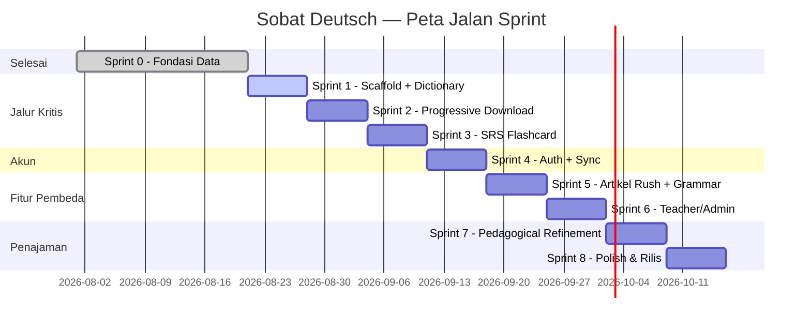

# Execution Plan — Sobat Deutsch

**Versi Dokumen:** 1.3 — tracker terpisah ([docs/SPRINT_CHECKLIST.md](./SPRINT_CHECKLIST.md)) + mandat DONE di [CLAUDE.md](../CLAUDE.md) ditambahkan

> **Progres task TIDAK dicatat di dokumen ini.** Dokumen ini adalah rencana (jarang diubah). Tracker live ada di **[docs/SPRINT_CHECKLIST.md](./SPRINT_CHECKLIST.md)** — 78 task, di-generate mekanis dari tabel task di bawah. Kalau task di sini berubah, regenerate checklist-nya (jangan edit manual, mencegah drift). Aturan kapan sebuah task boleh ditandai DONE (gate build/typecheck/lint/test + tidak ada error/warning baru + bukti wajib diisi) mengikat lewat **[CLAUDE.md](../CLAUDE.md)**, supaya berlaku di setiap sesi kerja walau dokumen ini tidak dibuka.
**Tanggal:** 20 Agustus 2026
**Sumber acuan:** [docs/PRD.md](./PRD.md) v4.1 (WHAT) + [docs/ARCHITECTURE.md](./ARCHITECTURE.md) v2.1 (HOW)
**Disusun oleh:** peran Scrum Master / Tech Lead — dokumen ini menerjemahkan requirement & desain teknis menjadi backlog yang bisa langsung dikerjakan, tanpa perlu menafsirkan ulang PRD/Architecture.

---

## Daftar Isi

1. [Metodologi & Asumsi](#1-metodologi--asumsi)
2. [Epic Mapping (PRD → Epic → Modul Arsitektur)](#2-epic-mapping)
3. [Definition of Ready & Definition of Done](#3-definition-of-ready--definition-of-done)
4. [Peta Jalan Sprint](#4-peta-jalan-sprint)
5. [Sprint 0 — Fondasi Data (Retrospektif, Selesai)](#sprint-0--fondasi-data-retrospektif-selesai)
6. [Sprint 1 — Scaffold & Dictionary Inti](#sprint-1--scaffold--dictionary-inti)
7. [Sprint 2 — Progressive Full Download & Offline](#sprint-2--progressive-full-download--offline)
8. [Sprint 3 — SRS Flashcard Inti](#sprint-3--srs-flashcard-inti)
9. [Sprint 4 — Auth & Sinkronisasi](#sprint-4--auth--sinkronisasi)
10. [Sprint 5 — Artikel Rush & Grammar](#sprint-5--artikel-rush--grammar)
11. [Sprint 6 — Teacher/Admin Workflow](#sprint-6--teacheradmin-workflow)
12. [Sprint 7 — Penajaman Pedagogis](#sprint-7--penajaman-pedagogis)
13. [Sprint 8 — Polish & Rilis](#sprint-8--polish--rilis)
14. [Traceability Matrix (Cakupan FR per Sprint)](#14-traceability-matrix)
15. [Risiko & Jalur Kritis](#15-risiko--jalur-kritis)

---

## 1. Metodologi & Asumsi

| Asumsi | Nilai | Alasan |
|---|---|---|
| Ukuran tim | 1 developer (solo) | Konteks proyek sejauh ini; sprint di-scope untuk kapasitas solo, bukan tim |
| Panjang sprint | 1 minggu | Siklus pendek untuk solo dev supaya bisa sering menilai ulang prioritas, bukan 2 minggu penuh tanpa checkpoint |
| Estimasi | T-shirt size (S = ≤1 hari, M = 2-3 hari, L = 4-5 hari) | Tidak ada data velocity historis untuk story point yang bermakna |
| Urutan sprint | Mengikuti Fase 0-5 di PRD §19, dipecah lebih rinci per sprint mingguan | PRD §19 sudah menetapkan urutan fase; dokumen ini menurunkannya jadi unit kerja mingguan |
| Definisi "selesai" per task | Lihat §3 — WAJIB ada AC PRD yang lolos, bukan cuma "kode jalan" | Konsisten dengan standar ketelitian yang sudah ditegakkan di seluruh proyek ini (lihat riwayat audit data §21.2e-k PRD) |

**Catatan penting:** Sprint 0 (Fondasi Data) **sudah selesai** sebelum dokumen ini dibuat — dicatat di sini secara retrospektif untuk kelengkapan jejak, bukan sebagai rencana ke depan.

---

## 2. Epic Mapping

| Epic | Modul Arsitektur (§3) | Fitur PRD (§7) | Prioritas |
|---|---|---|---|
| **E1 — Data Pipeline** | `scripts/*.py` | §21.2 (seluruh) | Selesai (Sprint 0) |
| **E2 — Dictionary & Progressive Download** | `modules/dictionary/`, `core/search/`, `core/dictSync/` | §7.2, §21.3 | Must, jalur kritis |
| **E3 — SRS Flashcard** | `modules/srs/` | §7.3 | Must |
| **E4 — Auth & Guest Mode** | `modules/auth/` | §7.1 | Must |
| **E5 — Sinkronisasi** | `modules/sync/` | §6.7 | Must |
| **E6 — Artikel Rush** | `modules/quiz/` | §7.4 | Must |
| **E7 — Grammar (Konjugasi/Deklinasi)** | bagian `modules/dictionary/` | §7.5 | Must (tapi butuh data enrichment, lihat blocker di §15) |
| **E8 — Teacher/Admin Workflow** | `modules/teacher/`, `modules/admin-review/` | §7.1a | Must |
| **E9 — Statistik & Progres** | `modules/stats/` | §6.6 | Should |
| **E10 — Pedagogical Refinement** | bagian `modules/srs/` | §10, Pattern Drill | Should |
| **E11 — PWA/Aksesibilitas/Polish** | `core/db/`, seluruh UI | §11, §9.4-9.5 PRD | Should/Must campuran |

---

## 3. Definition of Ready & Definition of Done

### Definition of Ready (sebelum task masuk sprint)
- Task punya referensi FR/BR/AC PRD yang jelas (tidak ada task tanpa jejak ke requirement).
- Task punya referensi section Architecture untuk *bagaimana* dibangun (skema, API contract, atau modul).
- Dependency ke task lain sudah diidentifikasi (lihat kolom "Depends on" tiap tabel sprint).

### Definition of Done (sebelum task ditutup)
- Kode berjalan sesuai **AC PRD yang direferensikan** — dicek manual/otomatis, bukan diasumsikan.
- Tidak melanggar **BR (Business Rule)** yang relevan (mis. BR-SRS-04 "tema tidak boleh jadi urutan belajar" — kalau task terkait queue SRS, ini wajib dicek eksplisit).
- RLS/keamanan (§8 Architecture) aktif untuk setiap tabel baru yang disentuh — tidak ada tabel Supabase baru tanpa RLS.
- Untuk task yang menyentuh data kamus: dijalankan `scripts/validate_dictionary.py` bila relevan (regression test yang sudah ada, PRD §21.2e).

### NFR Cross-Cutting (berlaku terus-menerus, BUKAN task tersendiri per sprint)

NFR berikut **tidak punya baris task khusus** di sprint manapun karena sifatnya melekat ke setiap task yang relevan, bukan satu unit kerja diskrit — wajib dicek sebagai bagian DoD tiap task yang menyentuh area terkait, dan diverifikasi ulang secara eksplisit di **S8-08 (regresi penuh)**:

| NFR | Diverifikasi di area | Kapan dicek |
|---|---|---|
| NFR-SEC-01, NFR-SEC-02, NFR-SEC-03, NFR-SEC-04, NFR-SEC-05, NFR-SEC-06, NFR-SEC-07, NFR-SEC-08 (HTTPS, hash password, validasi token, XSS/CSRF/SQLi, rate limit, PII, hapus data) | Setiap task yang menyentuh auth/API (Sprint 4, 6) | Tiap task terkait + S8-08 |
| NFR-PERF-01, NFR-PERF-01a, NFR-PERF-01b, NFR-PERF-02, NFR-PERF-03, NFR-PERF-04, NFR-PERF-05, NFR-PERF-06, NFR-PERF-07 (waktu respons, ukuran dataset) | Sprint 2 (state machine), diukur ulang | S2-08, S8-08 |
| NFR-REL-01, NFR-REL-02, NFR-REL-03, NFR-REL-04 (offline, uptime, ketahanan data) | Sprint 2 (offline), Sprint 4 (sync) | S2-08, S4-07, S8-08 |
| NFR-COMP-01, NFR-COMP-02, NFR-COMP-03, NFR-COMP-04 (kompatibilitas browser/device/PWA) | Seluruh UI | S8-03, S8-08 |
| NFR-MNT-01, NFR-MNT-02, NFR-MNT-03, NFR-MNT-04 (pipeline re-runnable, skema terdokumentasi, atribusi, kebijakan privasi) | Data pipeline (selesai Sprint 0) + dokumen ini sendiri | S8-08 (audit dokumentasi final) |
| NFR-UX-01, NFR-UX-07 (mobile-first, zero-friction ≤1 tap) | S1-11 (Guest session), seluruh navigasi utama | S1-11, S8-08 |

**S8-08 diperluas** (lihat Sprint 8): checklist regresi sekarang WAJIB mencakup seluruh NFR di atas, bukan cuma 60+ AC PRD §14.

---

## 4. Peta Jalan Sprint

---

## Sprint 0 — Fondasi Data (Retrospektif, Selesai)

**Tujuan:** Dataset kamus siap pakai, tervalidasi ketat.
**Status:** ✅ Selesai (20 Agustus 2026).

| Task | PRD Ref | Hasil |
|---|---|---|
| Download & normalisasi kaikki.org | §21.2a-c | 110.894 lemma, 19,02MB |
| Frequency ranking | §21.2d | 26.051 lemma dapat rank |
| Validasi ground truth | §21.2e | 45/45 lolos |
| Audit linguistik independen | §21.2f | 100% benar pada sample rawan-jebakan |
| Audit kode sistematis (2 putaran) | §21.2i, §21.2j | 13 bug diperbaiki |
| Cross-check UniMorph | §21.2k | Dievaluasi, tidak diintegrasikan |
| PRD & Architecture disusun + diaudit konsistensi | Seluruh dokumen | v4.1 / v2.1 |

**Tidak ada task tersisa dari Sprint 0** — dicatat di sini murni untuk kelengkapan jejak proyek.

---

## Sprint 1 — Scaffold & Dictionary Inti

**Tujuan Sprint:** Aplikasi React jalan, bisa cari kata (mode server dulu / State A), fondasi Supabase siap.
**Epic:** E2 (sebagian), fondasi E4.

| ID | Task | PRD Ref | Architecture Ref | Est. | Depends on |
|---|---|---|---|---|---|
| S1-01 | Scaffold project Vite+React+TypeScript+Tailwind | §21.2 (stack) | §1.3 | S | — |
| S1-02 | Setup Supabase project (dev) + Supabase CLI lokal | §21.2 | §7.1 | S | S1-01 |
| S1-03 | Migration `0001_profiles.sql` s.d. `0004_dictionary.sql` (mendefinisikan skema kolom enrichment — datanya sendiri sudah terisi parsial sejak Sprint 0, lihat PRD §21.2l, akan ikut terbawa saat S1-04 import) | §12.2 | §5 (migration 0001-0004) | M | S1-02 |
| S1-04 | `import_to_supabase.py` — import `dictionary.sqlite` → tabel `dictionary` + isi `dictionary_meta` | FR-ADM-03 | §5 catatan migrasi §0004 | M | S1-03 |
| S1-05 | Edge Function `dictionary-search` (FTS Postgres) | FR-DICT-02a | §6.2 | M | S1-04 |
| S1-06 | UI: Search bar + autocomplete + halaman detail kata (mode State A, server-only dulu). Kata benda tampil kapital sesuai kaidah Jerman; entri multi-POS (mis. "sein" verb vs determiner) tampil sesuai konteks, bukan entri pertama acak; field NULL (gender/plural belum ada) ditandai "tidak tersedia", bukan ditebak | FR-DICT-01, FR-DICT-07-11, FR-DICT-13, BR-DICT-04/06/08 | §7.2 tabel | L | S1-05 |
| S1-07 | Normalisasi input (umlaut, ß/ss, fuzzy) | FR-DICT-03, FR-DICT-05, AC-DICT-02/03 | §6.2 | M | S1-06 |
| S1-08 | Color coding gender + label teks wajib (aksesibilitas) | FR-DICT-07, NFR-UX-03, AC-DICT-04, AC-UX-03 | §11.2 PRD | S | S1-06 |
| S1-09 | Gender clue berbasis suffix | FR-DICT-11, BR-DICT-05, AC-DICT-06 | §7.2 | S | S1-06 |
| S1-10 | Atribusi lisensi CC BY-SA di UI | FR-DICT-17, BR-DICT-03, AC-DICT-10 | — | S | S1-06 |
| S1-11 | Sesi Guest otomatis saat app dibuka (tanpa layar login) — **task yang sebelumnya tidak ada di rencana manapun, ditambahkan saat audit konsistensi** | FR-AUTH-01, BR-AUTH (implisit: Guest = tidak ada baris `profiles`, lihat PRD §12.2 catatan role), UF-01 | §21.6 (Guest = seluruh data client-side) | S | S1-01 |
| S1-12 | Halaman detail kata: pastikan artikel definit/indefinit/negasi (FR-DICT-08) dan bentuk plural (FR-DICT-09) benar-benar tampil — verifikasi eksplisit, bukan asumsi bahwa S1-06 otomatis mencakup ini | FR-DICT-08, FR-DICT-09, AC-DICT-05 | §7.2 tabel | S | S1-06 |

**Sprint Goal check:** di akhir sprint, user bisa buka app, cari kata Jerman, dan dapat hasil lengkap (gender berwarna, plural, POS) — semuanya lewat server (State A), belum offline.

---

## Sprint 2 — Progressive Full Download & Offline

**Tujuan Sprint:** State machine A/B/C berjalan penuh — kamus bisa dipakai 100% offline setelah unduhan pertama.
**Epic:** E2 (selesai), fondasi E11 (PWA).

| ID | Task | PRD Ref | Architecture Ref | Est. | Depends on |
|---|---|---|---|---|---|
| S2-01 | `export_dictionary_full.py` — export tabel `dictionary` → `dictionary-full.v1.json`, upload ke Supabase Storage | §21.4 | §7.3 | M | S1-04 |
| S2-02 | Setup Dexie schema: `dictionary`, `dictionaryStaging`, `dictSyncMeta` | §21.3 skema Dexie | §4.2 | S | S1-01 |
| S2-03 | `core/dictSync`: cek `dictionary_meta.version`, unduh background, verifikasi checksum/row_count, swap atomik; beri tahu user saat versi baru tersedia | FR-DICT-02c/02d/02e, FR-SYNC-05 | §2.4 sequence diagram | L | S2-01, S2-02 |
| S2-04 | `core/search`: router State A/B/C (lokal vs server) + FlexSearch/MiniSearch index di atas Dexie | FR-DICT-02 | §21.3 state machine | L | S2-03 |
| S2-05 | Indikator status unduhan (badge non-intrusive + retry manual) | FR-DICT-02f, NFR-PERF-01b | §21.3 | S | S2-03 |
| S2-06 | Pesan jelas saat offline + State A (belum pernah unduh) | FR-DICT-02b, AC-DICT-09 | — | S | S2-04 |
| S2-07 | vite-plugin-pwa: service worker + manifest (app dapat dipasang sebagai PWA) | FR-SYNC-04, NFR-COMP-03 | §1.3 | M | S1-01 |
| S2-08 | Uji offline penuh: matikan network, pastikan search tetap jalan (State B) | AC-DICT-09, NFR-REL-01 | — | S | S2-04, S2-07 |

**Sprint Goal check:** matikan wifi setelah app pernah dibuka sekali online → search kata tetap instan dan lengkap. Ini janji inti produk (§3.3 PRD) — WAJIB lolos sebelum lanjut sprint berikutnya.

---

## Sprint 3 — SRS Flashcard Inti

**Tujuan Sprint:** Deck + flashcard + algoritma SM-2 berjalan, sepenuhnya lokal (Guest mode).
**Epic:** E3.

| ID | Task | PRD Ref | Architecture Ref | Est. | Depends on |
|---|---|---|---|---|---|
| S3-01 | Dexie schema: `decks`, `srsCards`, `reviewLogs`, `syncQueue` | §12.2 | §4.2 | S | S2-02 |
| S3-02 | CRUD deck (buat/rename/hapus) | FR-SRS-01 | — | S | S3-01 |
| S3-03 | "Add to deck" dari halaman detail kata, generate `card_type` sesuai jenis kata (`gender`/`plural`/`konjugasi`/`cloze-kasus`/`arti`) | FR-SRS-02/03/04, BR-SRS-01 | §7.3 | M | S2-04, S3-02 |
| S3-04 | Algoritma SM-2 (interval, ease factor, due date); simpan riwayat setiap review ke `reviewLogs` (lokal, disinkron di Sprint 4) | FR-SRS-07/16/18, BR-SRS-08/09/11 | §4.1 skema `srs_cards`/`review_logs` | M | S3-01 |
| S3-05 | UI flip-card + rating (Lupa/Sulit/Sedang/Mudah) | FR-SRS-08/14, AC-SRS-05/06 | §7.3 | M | S3-04 |
| S3-06 | Queue interleaved (kartu baru urut frequency_rank, review campur) | FR-SRS-09/10, BR-SRS-02/03/04, AC-SRS-01/02 | §10 PRD (prinsip pedagogis) | L | S3-04 |
| S3-07 | Kartu verba wajib pakai kalimat contoh (bukan kata+arti polos) | FR-SRS-05, BR-SRS-05, AC-SRS-03 | — | M | S3-03 |
| S3-08 | Ringkasan sesi review | FR-SRS-15, AC-SRS-09 | — | S | S3-05 |
| S3-09 | Sesi review lanjut dari posisi terakhir (interrupted session) | AC-SRS-11 | — | S | S3-05 |

**Sprint Goal check:** Guest bisa cari kata → add to deck → review pakai SM-2 → semua tersimpan lokal, tanpa akun.

---

## Sprint 4 — Auth & Sinkronisasi

**Tujuan Sprint:** Registrasi/login berfungsi, migrasi data Guest→akun, sinkronisasi lintas device.
**Epic:** E4, E5.

| ID | Task | PRD Ref | Architecture Ref | Est. | Depends on |
|---|---|---|---|---|---|
| S4-01 | Integrasi Supabase Auth: signup, login, logout. Validasi format email + kekuatan password saat signup; pesan generik saat kredensial salah (anti-enumerasi); sesi persistent via SDK default (tidak perlu kode custom) | FR-AUTH-02/03/05/08/10, BR-AUTH-01/02/03/07, AC-AUTH-02/03/04/06 | §6.1 | M | S1-02 |
| S4-02 | Reset password + verifikasi email (kirim + resend + link sekali-pakai 1 jam) | FR-AUTH-04/07, BR-AUTH-04/06/08, AC-AUTH-08/09/10 | §6.1 | M | S4-01 |
| S4-03 | Rate limiting login (5x gagal → lock 15 menit) | FR-AUTH-14, BR-AUTH-05, AC-AUTH-07 | Supabase Auth settings | S | S4-01 |
| S4-04 | Edge Function `migrate-guest-data` | FR-AUTH-09, BR-AUTH-09, AC-AUTH-05 | §6.4 | L | S3-01, S4-01 |
| S4-05 | Prompt registrasi kontekstual (bukan gate) | §7.1 PRD | §11.1 | S | S4-01 |
| S4-06 | Migration `0002_decks_and_cards.sql`, `0003_review_logs_and_quiz.sql` (RLS) | §12.2 | §5 | M | S1-03 |
| S4-07 | Sync engine: queue offline → push saat online, last-write-wins per entitas; `review_logs` append-only digabung, tidak ditimpa | FR-SYNC-01/02/03, BR-SYNC-01/02/03/04, AC-SYNC-01/02/03/04 | §9.4 | L | S3-01, S4-06 |
| S4-08 | Indikator status sinkronisasi | FR-SYNC-06 | — | S | S4-07 |
| S4-09 | Hapus akun (dengan konfirmasi) | FR-AUTH-13, BR-AUTH-10, AC-AUTH-12 | §6.1 | S | S4-01 |
| S4-10 | RLS test: user A tidak bisa akses data user B; endpoint terproteksi menolak request tanpa token valid | BR-AUTH-11/12, FR-AUTH-16, AC-AUTH-13/14 | §8.1 threat model | S | S4-06 |
| S4-11 | **(baru, ditemukan saat audit — sebelumnya tidak ada task)** Ubah password (wajib password lama benar) | FR-AUTH-11, AC-AUTH-11 | §6.1 | S | S4-01 |
| S4-12 | **(baru, ditemukan saat audit)** Edit profil: nama tampilan + preferensi (limit kartu harian, tema, bahasa UI) | FR-AUTH-12 | §4.1 `profiles` | S | S4-01 |
| S4-13 | Dataset kamus (`dictionary`) tetap read-only bagi Student/Teacher biasa — verifikasi RLS `dictionary_public_read` tidak punya policy write untuk role non-service | BR-DICT-01/02 | §5 migration `0004` | S | S1-03 |

**Sprint Goal check:** Guest dengan 15 kartu → registrasi → data ikut pindah → login di device lain → data sama.

---

## Sprint 5 — Artikel Rush & Grammar

**Tujuan Sprint:** Fitur pembeda utama produk (kuis + tabel konjugasi/deklinasi).
**Epic:** E6, E7.

**Update 20 Agustus 2026 — blocker ini SUDAH SELESAI** (dikerjakan lebih awal dari rencana, lihat PRD §21.2l), bukan lagi menunggu di Sprint 5. `conjugation_table` terisi 98,1% (10.486/11.118 verb), `case_governance` terisi untuk 64 verba paling umum (kurasi manual, kaikki.org tidak punya data ini sama sekali), `ablaut_class` terisi untuk verba strong/irregular. Task S5-00 di bawah dipertahankan sebagai jejak, statusnya diubah jadi "sudah selesai, tinggal dipakai UI" — S5-05 s.d. S5-09 sekarang bisa langsung mulai tanpa menunggu.

| ID | Task | PRD Ref | Architecture Ref | Est. | Depends on |
|---|---|---|---|---|---|
| ~~S5-00~~ | ~~Enrichment pipeline~~ — **Selesai**: `scripts/enrich_verb_grammar.py` + `scripts/verb_case_governance.py` + `scripts/assign_level_proxy.py` (PRD §21.2l) | FR-GRAM-01/07/08 | §4.1 catatan enrichment | ~~L~~ Selesai | Sprint 0 selesai |
| S5-01 | UI kuis Artikel Rush: timer, 3 tombol artikel, feedback instan; simpan high score personal; berjalan penuh offline (data lokal) | FR-QUIZ-01/02/03/09/10/11, BR-QUIZ-01/02, AC-QUIZ-01/02/03/06/07 | §7.4 | M | S2-04 |
| S5-02 | Weighted word selection (kata sering salah lebih sering muncul) | FR-QUIZ-07, BR-QUIZ-03/06 | — | M | S5-01 |
| S5-03 | Filter kualitas kata untuk kuis (exclude noise noun-frequency-tinggi, §21.2d PRD) | BR-QUIZ-05 | §21.2d catatan kurasi | M | S5-01 |
| S5-04 | Mistake tracker + jembatan ke SRS ("Tambahkan ke deck") | FR-QUIZ-04/05/06, BR-QUIZ-04, AC-QUIZ-04/05 | §4.1 `mistake_tracker` | M | S5-01, S3-03 |
| S5-05 | Tabel konjugasi verba (Präsens/Präteritum/Perfekt); tampilkan kata bantu haben/sein untuk Perfekt (data sudah tersedia dari `auxiliary` + `conjugation_table.perfekt`, §21.2l PRD — **verifikasi tampil benar, bukan asumsi otomatis benar**) | FR-GRAM-01/03, AC-GRAM-01 | — | M | S5-00 (selesai) |
| S5-06 | Trennbare Verben (pemisahan otomatis); tandai weak vs strong/irregular (`verb_class`, sudah terisi §21.2l) | FR-GRAM-02/07, AC-GRAM-02 | — | S | S5-05 |
| S5-07 | Tabel deklinasi 4 kasus | FR-GRAM-04/05, AC-GRAM-05 | — | M | S5-00 (selesai) |
| S5-08 | Case governance ditampilkan di halaman kata (64 verba terkurasi, §21.2l — verba di luar daftar tampil "tidak tersedia" sesuai BR-DICT-07, bukan kosong tanpa keterangan) | FR-GRAM-08, AC-GRAM-04 | — | S | S5-00 (selesai) |
| S5-09 | Verba sepola (ablaut class sama) ditampilkan sebagai referensi | FR-GRAM-06, AC-GRAM-03 | — | S | S5-00 (selesai) |
| S5-10 | **(baru, ditemukan saat audit)** Tambah tabel konjugasi/deklinasi tertentu langsung ke deck sebagai kartu | FR-GRAM-09 | §7.3 | S | S5-05, S5-07, S3-03 |

**Sprint Goal check:** user bisa main Artikel Rush dan lihat skor, DAN bisa lihat tabel konjugasi asli (bukan placeholder) untuk verba umum.

---

## Sprint 6 — Teacher/Admin Workflow

**Tujuan Sprint:** Alur koreksi komunitas berjalan end-to-end.
**Epic:** E8.

| ID | Task | PRD Ref | Architecture Ref | Est. | Depends on |
|---|---|---|---|---|---|
| S6-01 | Migration `0005_teacher_workflow.sql` (role, `teacher_applications`, `dictionary_suggestions`, `admin_decision_log`) | §12.2 | §5 (migration 0005) | M | S4-06 |
| S6-02 | UI: form permohonan jadi Teacher (self-apply). Hanya Registered User (bukan Guest); tolak permohonan baru kalau masih ada yang `pending` | FR-TEACH-01, BR-DICT-12, UF-10 | §7.1a | S | S6-01, S4-01 |
| S6-03 | Edge Function `admin-review-application` (approve/reject + insert `admin_decision_log`) | FR-ADM-09/10 | §6.2b | M | S6-01 |
| S6-04 | UI: tombol "Ajukan koreksi" di halaman detail kata (role Teacher saja) | FR-TEACH-02, UF-11 | §6.2a | M | S6-01 |
| S6-05 | Constraint anti-duplikat saran pending (BR-DICT-09) — sudah di migration, verifikasi UI menangani error dengan baik | BR-DICT-09, FR-TEACH-04 | §5 unique index | S | S6-04 |
| S6-06 | UI: "Saran Saya" (status pending/approved/rejected) | FR-TEACH-03 | §6.2a | S | S6-04 |
| S6-07 | UI Admin: queue saran (filter lemma/Teacher/tanggal) | FR-ADM-06 | — | M | S6-01 |
| S6-08 | Fungsi `approve_suggestion`/`reject_suggestion` (RPC) + Edge Function `admin-review-suggestion` | FR-ADM-07/08, BR-DICT-10/11 | §5 fungsi, §6.2b | M | S6-01 |
| S6-09 | Trigger republish: setelah approve, tandai perlu re-export (manual oleh Admin, bukan otomatis per-approval — keputusan batching). Proses refresh dataset TIDAK BOLEH menyentuh/menghapus data progres pengguna manapun | BR-SYNC-05 | §9.3, §9.5 | S | S6-08, S2-01 |
| S6-10 | **(baru, ditemukan saat audit)** Laporan sederhana "kata ini salah" dari Student/Guest (beda dari saran terstruktur Teacher) + UI Admin melihat & menerapkan koreksi langsung (tanpa lewat alur suggestion/approval Teacher — untuk kasus mendesak) | FR-DICT-16, FR-ADM-01/02 | §6.2a (pola serupa, endpoint terpisah) | M | S6-07 |
| S6-10 | Verifikasi end-to-end: Teacher submit → Admin approve → client lain deteksi State C → download versi baru | AC terkait (buat AC baru bila belum ada) | §2.5 sequence | M | S6-08, S2-03 |

**Sprint Goal check:** submit 1 saran koreksi asli (misal plural yang salah dari temuan pipeline sebelumnya) → Admin approve → versi baru ter-generate → device lain (simulasi) update otomatis.

---

## Sprint 7 — Penajaman Pedagogis

**Tujuan Sprint:** Prinsip SLA (§10 PRD) benar-benar terimplementasi di SRS, bukan cuma dicatat sebagai niat.
**Epic:** E10.

| ID | Task | PRD Ref | Architecture Ref | Est. | Depends on |
|---|---|---|---|---|---|
| S7-01 | Cloze card untuk verb+preposisi+kasus | FR-SRS-06, BR-SRS-06, AC-SRS-04 | §7.3 | L | S5-08, S3-07 |
| S7-02 | Pattern Drill: mini-lesson saat ablaut class baru muncul | FR-SRS-11, BR-SRS-07, AC-SRS-07 | §10 PRD | M | S5-09 |
| S7-03 | Limit kartu baru/review harian (setting user) | FR-SRS-12 | §4.1 `profiles` | S | S3-06 |
| S7-04 | Suspend/bury kartu | FR-SRS-13, BR-SRS-10 | — | S | S3-04 |
| S7-05 | Filter tema HANYA untuk browsing, audit ulang tidak ada tempat yang pakai tema untuk urutan (BR-SRS-04) | BR-SRS-04 | §10 PRD | S | S3-06 |
| S7-06 | Verifikasi interleaving nyata (bukan cuma klaim) — test manual: ambil 1 sesi review, cek distribusi ablaut_class/tema tidak berurutan | AC-SRS-02 | §10 PRD | S | S3-06, S7-02 |

**Sprint Goal check:** ambil satu sesi review 20 kartu, buktikan tidak ada 2 kartu ablaut class sama berturut-turut (kecuali kebetulan statistik wajar).

---

## Sprint 8 — Polish & Rilis

**Tujuan Sprint:** Siap dipakai publik.
**Epic:** E9, E11.

| ID | Task | PRD Ref | Architecture Ref | Est. | Depends on |
|---|---|---|---|---|---|
| S8-01 | Dashboard statistik (kata dipelajari, akurasi per kategori, riwayat aktivitas harian) | FR-STAT-01/02/03/04 | §4.1 | M | S3-04, S5-04 |
| S8-02 | Dark mode penuh (bukan cuma toggle, semua warna gender tetap kontras AA) | NFR-UX-02/08 | §11.2 PRD | M | — |
| S8-03 | Audit aksesibilitas: keyboard-only, `prefers-reduced-motion`, target sentuh 44px | NFR-UX-04/05/06, AC-UX-04/05 | §11.3 PRD | M | Seluruh UI selesai |
| S8-04 | Ekspor deck (CSV/Anki) | FR-SRS-17 | — | S | S3-02 |
| S8-05 | OAuth Google | FR-AUTH-06 | §6.1 | M | S4-01 |
| S8-06 | TTS (Web Speech API) + graceful degradation | FR-DICT-12, NFR-COMP-04 | — | S | S1-06 |
| S8-07 | Error tracking (Sentry) + observability dasar | — | §7.4 | S | — |
| S8-08 | Uji regresi penuh: 60+ AC PRD dicek satu-satu sebelum rilis | Seluruh §14 PRD | — | L | Semua sprint sebelumnya |

**Sprint Goal check:** checklist AC PRD §14 + NFR cross-cutting (§3) dijalankan, siap rilis.

---

## Sprint 9 — Perbaikan Pasca-Audit Regresi (S8-08)

**Tujuan Sprint:** Menutup gap yang ditemukan saat audit AC-by-AC penuh (S8-08, 20 Agustus 2026) — 6 bug mekanis dari audit itu sudah langsung diperbaiki di sesi yang sama, tapi 8 gap berikut bersifat fitur/perilaku (bukan bug satu-baris) sehingga sengaja dijadwalkan sebagai task terpisah alih-alih ditambal buru-buru saat audit. Semua task di sini punya AC yang sudah ada di PRD §14 — tidak ada AC baru.
**Epic:** E3 (SRS), E5 (Quiz), E7 (Sync).

| ID | Task | PRD Ref | Architecture Ref | Est. | Depends on |
|---|---|---|---|---|---|
| S9-01 | Resolusi konflik sync berbasis timestamp sungguhan (bukan arrival-order) — RPC compare-and-swap membandingkan `updated_at` sebelum menimpa `srs_cards` | AC-SYNC-02, BR-SYNC-02 | §12.2, §13.3 | M | S4-07 |
| S9-02 | Indikator status + retry manual untuk sinkronisasi SRS (deck/kartu/review log) — `SyncIndicator.tsx` saat ini hanya melaporkan status unduhan kamus, bukan `syncEngine` | AC-SYNC-01, AC-SYNC-03, FR-SYNC-06 | §12.2 | S | S4-07, S4-08 |
| S9-03 | Dukungan `prefers-reduced-motion` — nonaktifkan/kurangi animasi (`animate-spin`, `animate-pulse`, transition) di seluruh UI saat preferensi sistem aktif | AC-UX-05, NFR-UX-05 | §11.3 | S | — |
| S9-04 | Kartu arti verba tanpa kalimat contoh: cegah degradasi ke kata+arti polos (BR-SRS-05) — beri fallback eksplisit atau larang pembuatan kartu tipe ini sampai data contoh terisi | AC-SRS-03, BR-SRS-05 | §12.2 | S | S3-07 |
| S9-05 | Pattern Drill benar-benar tampil hanya SEKALI per ablaut class baru (butuh state/flag tersimpan, bukan re-render setiap kartu jenis itu muncul) | AC-SRS-07, BR-SRS-07 | §12.2 | M | S7-02 |
| S9-06 | Layar ringkasan sesi review sungguhan (jumlah kartu, akurasi, jadwal berikutnya) — saat ini cuma `alert()` | AC-SRS-09, FR-SRS-15 | §4.1 | S | S3-08 |
| S9-07 | Resume sesi review dari posisi PERSIS terakhir (index kartu tersimpan), bukan cuma re-derive antrean due dari awal | AC-SRS-11 | §12.2 | S | S3-09 |
| S9-08 | Tombol "Tambahkan semua" di layar rekomendasi Artikel Rush (saat ini hanya per-kata satu-satu) | AC-QUIZ-05, FR-QUIZ-06 | §4.1 | S | S5-04 |

**Sprint Goal check:** kedelapan AC di atas (AC-SYNC-01/02/03, AC-UX-05, AC-SRS-03/07/09/11, AC-QUIZ-05) berubah dari GAP-FOUND menjadi VERIFIED-BY-TEST atau VERIFIED-LIVE di `docs/SPRINT_CHECKLIST.md`.

---

## 13a. Backlog — Sengaja Belum Dijadwalkan (Should/Could, Bukan Terlewat)

Ditemukan lewat audit konsistensi (20 Agustus 2026): FR berikut **tidak punya task** di sprint manapun. Setelah triase, ini bukan celah yang harus ditambal jadi task baru — semuanya berprioritas **Should/Could** (bukan Must) di PRD, dan scope-nya masuk akal ditunda ke luar 8 sprint v1. Didaftar di sini secara eksplisit supaya statusnya **jelas sengaja ditunda**, bukan diam-diam terlewat:

| FR | Deskripsi | Prioritas PRD | Alasan ditunda |
|---|---|---|---|
| FR-DICT-04 | Pencarian dua arah (ID/EN → Jerman) | Should | Butuh dataset terjemahan balik yang belum dianalisis; v1 fokus Jerman→ID/EN saja |
| FR-DICT-06 | Lemmatisasi bentuk terinfleksi di search (`ging`→`gehen`) | Should | Perlu index morfologi tambahan di atas FlexSearch; v1 andalkan pencarian lemma langsung + fuzzy (S1-07) |
| FR-DICT-14 | Riwayat pencarian tersimpan | Should | Fitur kenyamanan, bukan penghalang fungsi inti |
| FR-DICT-15 | Filter kata berdasarkan tema/level/gender di UI browsing | Should | Data `theme_tags`/`level` baru terisi parsial (4,8% untuk level, §21.2l); filter UI ditunda sampai cakupan data lebih memadai |
| FR-GRAM-09 | *(dipindahkan — sudah jadi S5-10, lihat Sprint 5)* | Should | — |
| FR-AUTH-15 | Lihat & cabut sesi perangkat aktif | Could | Eksplisit Could di PRD, tidak blocking v1 |
| FR-STAT-05 | Proyeksi beban review beberapa hari ke depan | Could | Eksplisit Could di PRD |
| FR-ADM-04 | Metrik agregat penggunaan sistem | Could | Eksplisit Could; butuh observability dasar (S8-07) matang dulu |
| FR-ADM-05 | Admin nonaktifkan akun melanggar | Could | Eksplisit Could, tidak ada kasus penyalahgunaan terdefinisi di v1 |

**Keputusan:** backlog ini ditinjau ulang setelah Sprint 8 (rilis v1) — kalau ada demand nyata dari pengguna, diangkat jadi sprint baru (v1.1), bukan disisipkan paksa ke 8 sprint yang sudah padat.

---

## 14. Traceability Matrix

**Metodologi (diperbarui setelah audit 20 Agustus 2026):** cakupan di bawah diverifikasi lewat diff otomatis seluruh ID FR/BR/NFR individual di PRD §6/§8/§9 terhadap kemunculannya di dokumen ini (bukan cuma nama modul) — 185 ID total, 105 awalnya tidak ketemu ID individualnya (85 setelah dikoreksi untuk gaya sitasi ringkas `FR-AUTH-02/05/08`). Dari yang tidak ketemu: **13 ternyata task yang genuinely hilang** (ditambahkan sebagai S1-11/12, S4-11/12/13, S5-10, S6-10 di atas), **9 masuk backlog sengaja ditunda** (§13a, semua Should/Could), sisanya **NFR cross-cutting** (ditangani lewat DoD §3, bukan task diskrit) atau **BR yang melekat ke task existing** (ditambahkan sebagai sitasi tambahan ke kolom PRD Ref task terkait, bukan baris baru).

Cakupan modul FR PRD terhadap sprint:

| Modul FR (PRD §6) | Sprint |
|---|---|
| FR-AUTH-* (16 item) | Sprint 1 (Guest, S1-11), Sprint 4, Sprint 8 (OAuth) |
| FR-DICT-* (17+6 baru) | Sprint 1, Sprint 2 |
| FR-SRS-* (18) | Sprint 3, Sprint 7 |
| FR-QUIZ-* (11) | Sprint 5 |
| FR-GRAM-* (9) | Sprint 5 |
| FR-STAT-* (5) | Sprint 8 (FR-STAT-05 → backlog §13a) |
| FR-SYNC-* (6) | Sprint 2 (S2-03/07, PWA & version check), Sprint 4 (sync engine) |
| FR-ADM-* (10) | Sprint 6 (FR-ADM-04/05 → backlog §13a) |
| FR-TEACH-* (4) | Sprint 6 |
| BR-AUTH-*, BR-DICT-*, BR-QUIZ-*, BR-SRS-*, BR-SYNC-* | Melekat sebagai sitasi tambahan di task Sprint terkait (lihat kolom PRD Ref masing-masing task, bukan baris tersendiri) |
| NFR-SEC-*, NFR-PERF-*, NFR-REL-*, NFR-COMP-*, NFR-MNT-*, NFR-UX-* | Cross-cutting — lihat tabel §3 "NFR Cross-Cutting", diverifikasi ulang di S8-08 |

**Cakupan terverifikasi per 20 Agustus 2026:** seluruh 185 ID FR/BR/NFR individual di PRD sudah ditelusuri satu per satu (bukan cuma level modul) — hasilnya ada di tabel di atas + §13a. Setiap ID yang tidak muncul di task manapun sekarang punya salah satu dari tiga status eksplisit: **(a)** ditambahkan sebagai task baru, **(b)** dicatat sengaja ditunda di backlog §13a, atau **(c)** ditandai cross-cutting/melekat ke task lain. Tidak ada ID yang statusnya "tidak diketahui".

**Update pasca-audit S8-08 (20 Agustus 2026):** audit AC-by-AC penuh terhadap seluruh 59 AC §14 menemukan 8 AC yang statusnya GAP-FOUND (kode ada tapi perilakunya belum sesuai kriteria) — ditambahkan sebagai Sprint 9 di atas: AC-SYNC-01/02/03, AC-UX-05, AC-SRS-03/07/09/11, AC-QUIZ-05. Ini bukan FR/BR yang hilang dari tracking (semuanya sudah pernah dijadwalkan di Sprint 2-7), melainkan implementasi yang perlu diperbaiki/dituntaskan.

---

## 15. Risiko & Jalur Kritis

| Risiko | Sprint terdampak | Status |
|---|---|---|
| ~~Kolom enrichment Grammar (`conjugation_table`, dll) belum diisi pipeline~~ | Sprint 5 | ✅ **Selesai** (PRD §21.2l) — 98,1% conjugation_table, 64 verba case_governance, ablaut_class untuk verba strong. S5-05 s.d. S5-09 bisa mulai langsung |
| **State machine A/B/C (Sprint 2) adalah jalur kritis** — SRS (Sprint 3), Quiz (Sprint 5) semua butuh pencarian kamus lokal berfungsi dulu | Sprint 2 → semua sprint berikutnya | Masih berlaku — belum dikerjakan. Jangan lanjut Sprint 3 sebelum Sprint Goal Sprint 2 (offline penuh) benar-benar lolos AC-DICT-09 |
| ~~Level CEFR (A1-B1) belum ada di data~~ | FR-DICT-10, FR-QUIZ-08 | ✅ **Selesai** (PRD §21.2l) — proxy `frequency_rank`, 5.372 lemma (4,8%) dapat level, sisanya NULL (didokumentasikan sebagai heuristik, bukan klasifikasi resmi) |
| **Filter kurasi kualitas kata frekuensi tinggi untuk Artikel Rush** (noise seperti "Ich"/"Du" tercatat sebagai noun) | Sprint 5 (S5-03) | Masih terbuka — bukan blocker keras karena mitigasi sudah ada (BR-QUIZ-05, filter gender+plural terisi), tapi kurasi tambahan tetap dijadwalkan |
| **Publish dataset manual oleh Admin** (bukan otomatis) berarti ada jeda antara approve dan koreksi benar-benar sampai ke user | Sprint 6 | Sudah sesuai keputusan (percakapan sebelumnya) — dicatat di sini supaya tidak dianggap bug saat testing |
| Solo developer, 8 sprint × 1 minggu = ~2 bulan estimasi kasar | Semua | Estimasi T-shirt size di atas belum termasuk buffer untuk debugging/pembelajaran teknologi baru (Supabase, Dexie) bila developer belum familiar — sarankan buffer 20-30% |

**Kedua blocker Sprint 5 yang sebelumnya menggantung sudah diselesaikan (20 Agustus 2026)** — lihat PRD §21.2l untuk detail metodologi, angka hasil, dan bug yang ditemukan+diperbaiki selama proses (ablaut_class prefix bug, reflexive verb lemma matching bug). Sprint 5 sekarang bisa dikerjakan tanpa dependency ke task enrichment data.
